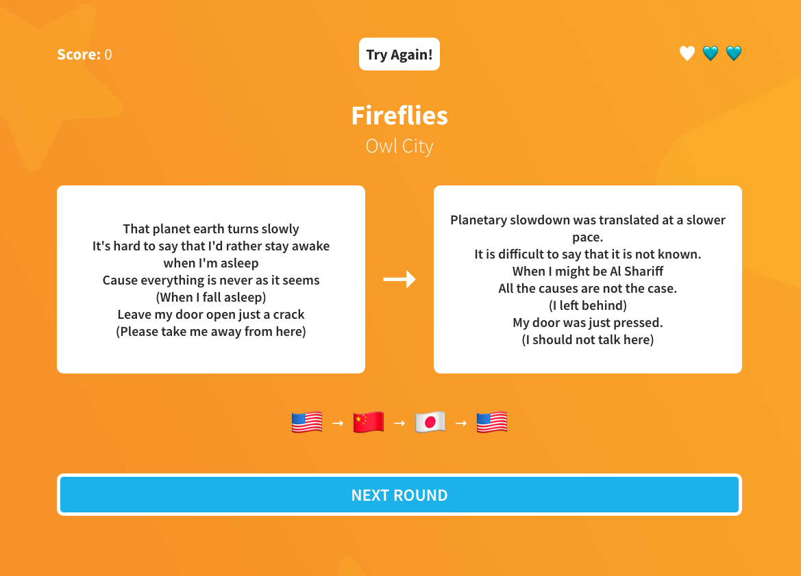

# Translyric

*Guess the song based on the translated lyrcs*

## Installation

- Download the project directory `translyric-game-main.zip`.
- Unzip and `cd` into `translyric-game-main`.
- Run `npm install` to install the necessary dependencies.
- Run `npm start` and you should be good to go.

## Credits

- Concept by [HIVEMIND](https://www.youtube.com/watch?v=zLP-NjDTZ_Q&ab_channel=HIVEMIND).
- Design inspired by [SongTrivia](https://songtrivia2.io/).
- Lyrics by [vagalume](https://api.vagalume.com.br/)'s lyric API.
- Translations by [LibreTranslate](https://libretranslate.com/).

## Samples

### Contribute
Feel free to submit *tested* categories via pull request.
